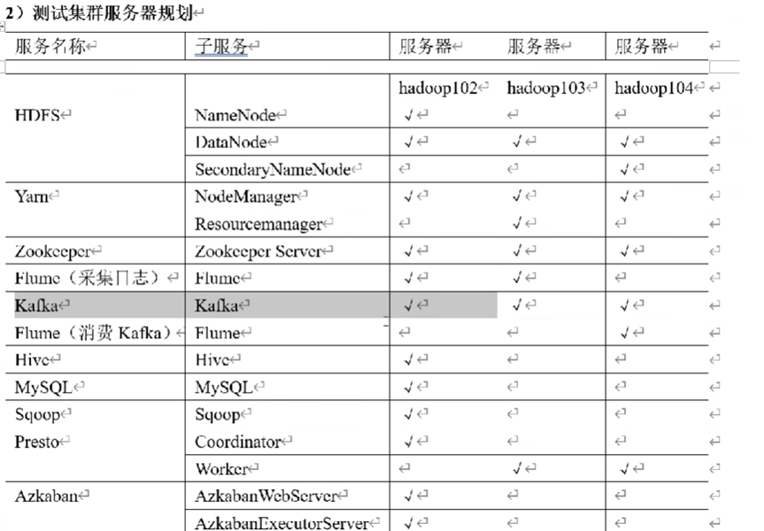
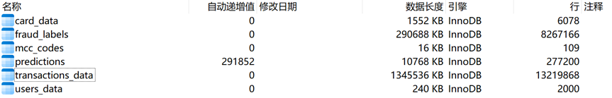
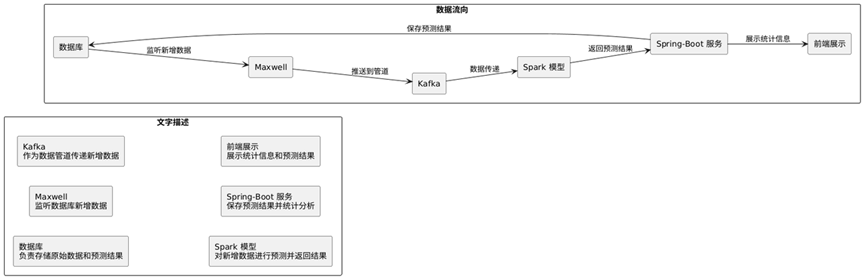
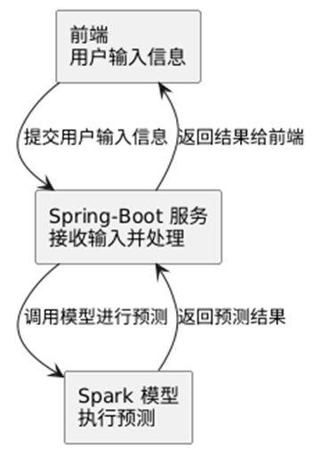
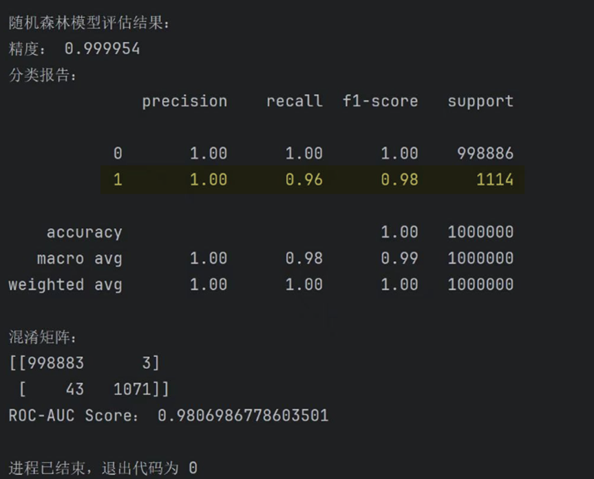
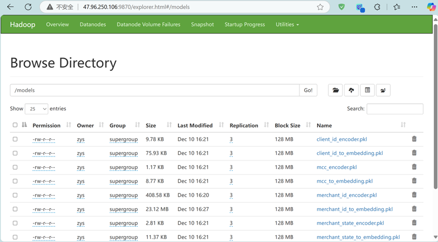
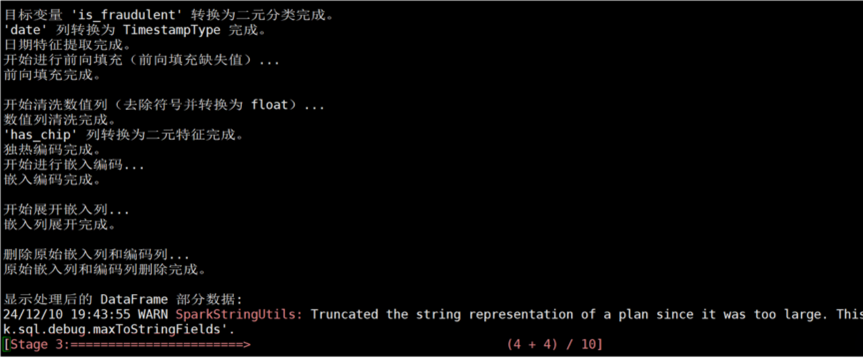
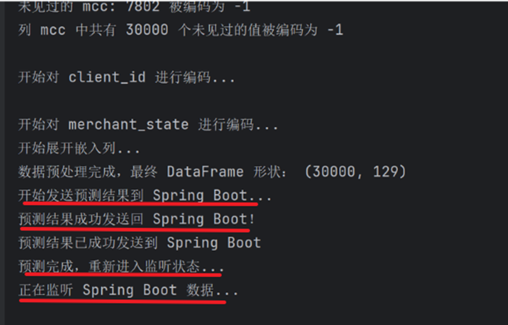
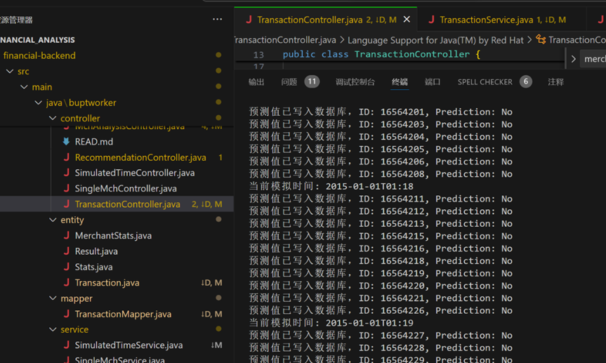

# 🚀 电商智能风控与推荐系统
# 项目背景和目的

## 1.1 项目背景

随着电子商务平台和互联网金融服务的快速发展，交易数据的规模和复杂性不断提升。商家需要通过技术手段提升运营效率、保障交易安全以及优化用户体验。然而，在实际运营中，欺诈交易、用户流失以及个性化推荐等问题对商家和平台的业务发展构成了挑战：

1. ​**​欺诈交易​**​不仅会对用户的资金安全造成威胁，还会对商家的信誉和经济利益产生重大影响，因此精准高效的欺诈识别是商家风控的核心需求。
2. ​**​数据分析​**​：商家在销售运营中积累了大量复杂数据，涉及交易时间、支付方式和消费者行为模式等变量。如何从这些数据中提取有价值的洞察并优化运营策略是数据分析的重要任务。
3. ​**​个性化推荐​**​（为用户推荐商品）在提升用户体验和促成交易方面起到关键作用，但受限于数据质量和模型性能，其准确性和实时性仍面临诸多挑战。
4. ​**​用户推荐​**​（为商家推荐用户）是商家获取新用户和提升现有用户参与度的重要手段。通过推荐系统，商家可以为潜在用户提供量身定制的服务，增加用户的留存率和购买率。
5. ​**​用户流失现象​**​对企业的收入和品牌忠诚度影响显著。提前预测用户流失趋势并采取应对策略是企业保持市场竞争力的关键。

本项目旨在通过先进的机器学习技术和分布式计算框架解决这些核心问题，为商家和平台提供精准高效的解决方案。

## 1.2 项目目的

本项目围绕电子商务和用户行为分析的核心需求，设计并实现了五大模块：

1. ​**​欺诈交易识别模块​**​：通过构建高效的欺诈交易预测模型，提升对欺诈行为的检测准确率和召回率，减少商家经济损失并提升用户的安全感。
2. ​**​商家数据分析模块​**​：利用大规模数据分析和基于Spark的分布式计算框架，提取商家的销售模式和消费者行为洞察，为运营策略的优化提供数据支持。
3. ​**​个性化推荐模块​**​（为用户推荐商品）：基于机器学习和分布式计算技术，开发个性化推荐系统，解决数据质量和模型性能问题，为用户提供更精准的推荐结果，从而提升平台的用户粘性和转化率。
4. ​**​用户推荐模块​**​（为商家推荐用户）：通过构建用户推荐系统，为商家推荐潜在用户或目标客户，提升市场拓展效果和现有用户参与度。该模块帮助商家针对性地推广产品或服务，优化用户获取策略。
5. ​**​流失用户预测模块​**​：采用LSTM模型预测用户流失趋势，并结合实时数据处理技术，为商家制定个性化的用户挽留策略提供依据，帮助企业减少潜在损失。

通过以上模块的构建，本项目旨在为商家和电子商务平台提供一个功能完善、高效稳定的技术解决方案，助力其在风控、用户管理和业务优化等方面提升竞争力。

# 二、项目开发环境

- 阿里云ECS服务器 3台（配置集群环境）
- Ubuntu22.07
- jdk1.8
- hadoop3.3.4
- spark3.3.1
- MySQL8.0
- Flume1.10.0
- zookeeper3.7.1
- kafka3.3.1

# 三、项目数据及来源

## 3.1 项目数据

​**​Financial Transactions Dataset​**​，数据集由以下5部分组成：

1. ​**​交易数据 (transactions_data.csv)​**​：共1322万条
   - 包含详细的交易记录，包括金额、时间戳和商家信息
   - 覆盖了整个2010年代的交易记录
   - 包括交易类型、金额和商家信息等特征
   - 非常适合用于分析消费模式和构建欺诈检测模型
2. ​**​卡片信息 (cards_dat.csv)​**​：共6078条
   - 包括信用卡和借记卡的详细信息
   - 包括卡片额度、类型和激活日期
   - 通过 card_id 与客户账户关联
   - 对于了解客户的财务概况至关重要
3. ​**​商户类别代码 (mcc_codes.json)​**​：共109条
   - 业务类型的标准分类代码
   - 支持交易分类和消费分析
   - 行业标准的MCC代码及其描述
4. ​**​欺诈标签 (train_fraud_labels.json)​**​：共827万条
   - 用于交易的二元分类标签
   - 标识交易是欺诈还是合法
   - 非常适合用于训练监督的欺诈检测模型
5. ​**​用户数据 (users_data)​**​：共2000条
   - 客户的基本人口统计信息
   - 与账户相关的详细信息
   - 支持客户分群和个性化分析

## 3.2 数据来源

​**​Financial Transactions Dataset​**​: Kaggle网站中下载的开源数据集。  
链接：[https://www.kaggle.com/datasets/computingvictor/transactions-fraud-datasets](https://www.kaggle.com/datasets/computingvictor/transactions-fraud-datasets)

# 四、项目内容

## 4.1 问题分析

### 4.1.1 欺诈交易识别模块

- 欺诈交易会对用户体验和商家运营造成重大影响。
- 准确检测欺诈交易是商家风控的核心需求。
- 本项目旨在构建高效的欺诈预测模型，以满足准确率、召回率等关键指标的要求。

### 4.1.2 商家数据分析模块

- 通过大规模数据分析识别商家的销售模式和消费者行为。
- 数据量庞大且复杂，涉及多个变量（如交易时间、支付方式、商家类型等），挑战在于如何高效处理这些数据并从中提取有价值的洞察。
- 传统分析方法在处理这些数据时存在性能瓶颈，而基于Spark的分布式计算框架能够有效应对大数据分析中的挑战，提供实时、高效的数据处理能力。

### 4.1.3 用户推荐模块

1. ​**​提升用户体验​**​
   - ​**​个性化服务​**​：通过分析用户的历史行为、偏好和兴趣，推荐模块能够为每位用户提供个性化的商家推荐。
   - 这种定制化的服务让用户感受到平台对其需求的理解和关注，提升了整体的用户满意度。
   - ​**​节省时间和精力​**​：用户在寻找感兴趣的商家时，不必逐一浏览大量商家信息。推荐模块能够快速筛选出符合用户偏好的商家，帮助用户高效地找到所需，提升使用体验。
2. ​**​增加用户粘性和活跃度​**​
   - ​**​提高用户参与度​**​：个性化推荐能够激发用户的兴趣，促使他们更频繁地访问平台，浏览推荐的商家，从而增加用户的活跃度。
   - ​**​增强用户忠诚度​**​：当用户频繁收到符合其兴趣的推荐时，会对平台产生信任感依赖感，进而增强用户忠诚度，减少用户流失率。
3. ​**​促进商家增长和优化资源配置​**​
   - ​**​增加商家曝光率​**​：更多符合用户需求的商家能够获得展示机会，提升其曝光率和潜在客户数量。
   - ​**​优化资源分配​**​：平台可以根据推荐模块的反馈数据，了解哪些商家更受欢迎，进而优化资源分配。
4. ​**​推动平台盈利​**​
   - ​**​提高转化率​**​：精准的商家推荐能够有效匹配用户需求，提升用户的购买意愿和转化率。
   - ​**​增强广告效果​**​：商家推荐模块可以为平台提供精准的广告投放机会，增加广告收入。

### 4.1.4 商家推荐模块

在本实验中，构建商家推荐系统涉及到机器学习、分布式计算和Web服务等多个技术模块。

1. ​**​数据质量问题​**​：
   - 数据源可能存在缺失值或异常值，特别是在用户和商家的ID映射过程中。如果数据库中的数据不完整或格式不统一，可能导致映射错误或模型训练不稳定，从而影响推荐结果的准确性。
   - 数据量庞大时，如何高效地进行预处理，尤其是在分布式环境下，可能会导致内存占用过高或处理速度缓慢。
2. ​**​模型性能问题​**​：
   - 由于使用了神经网络模型进行预测，模型的训练时间和推理速度可能较慢，尤其是在需要实时推荐的场景中。如果模型的推理速度无法满足低延迟需求，可能会影响系统的响应时间。
   - 模型的泛化能力可能不足，导致推荐结果的准确性不高，尤其是当训练数据集和实际使用场景存在差异时。
3. ​**​分布式计算瓶颈​**​：
   - 尽管使用了Spark进行分布式计算，但在大规模数据处理时，可能会遇到任务调度不均、资源分配不合理或计算节点负载过重等问题。这可能导致计算速度变慢，甚至出现计算失败或系统崩溃的情况。
   - 对于大规模的用户数据，在Spark中进行推荐计算时，如何平衡计算的负载和合理划分任务将是一个重要挑战。
4. ​**​系统集成与稳定性问题​**​：
   - Flask作为Web服务框架与Spark的分布式计算结合时，可能会遇到跨进程、跨网络的通信延迟问题，尤其是在通过REST API调用Python Flask服务时，网络不稳定或高并发请求可能导致服务不可用。
   - 系统中涉及多个组件（Flask、Spark、TensorFlow、数据库等），如果组件间的版本不兼容或配置不当，可能会导致系统崩溃或数据传输错误，影响整个推荐系统的稳定性和可维护性。

### 4.1.5 流失用户预测模块

用户流失预测是用户行为分析中的关键任务之一，其目标是提前发现有流失倾向的用户并采取针对性的运营策略，减少企业损失。该项目聚焦于以下问题：

- ​**​问题定义​**​：通过用户的历史交易数据预测用户是否会在未来一段时间内流失。
- ​**​现状挑战​**​：
  - ​**​数据量大​**​：1400万条交易记录，覆盖2000名用户。
  - ​**​数据稀疏​**​：某些用户在较长时间内交易频率低，可能导致数据缺失问题。
  - ​**​实时性需求​**​：需要将预测结果存储到数据库，为后续业务系统提供支持。
- ​**​目标​**​：构建一个基于 LSTM 的用户流失预测模型，并设计完整的数据预处理、模型训练、预测与存储的系统化解决方案。

## 4.2 设计方案

### 整体架构

# 五、 详细讲解——以欺诈预测为例

## 5.1 欺诈预测结果

## 5.2 spring-boot 与 Pyspark交互
### 模型和编码文件存入HDFS

### PySpark控制台：

### 连接后端Spring-boot：

•	提供标准化接口，便于扩展和维护。

•	数据交互：通过 HTTP 协议连接后端Spring-boot，实时获取数据和返回预测结果。

### 运行在spark上的模型监听spring-boot端口获取数据进行预测并返回结果

### 后端接收数据，并存入数据库

## 六、 前端效果

