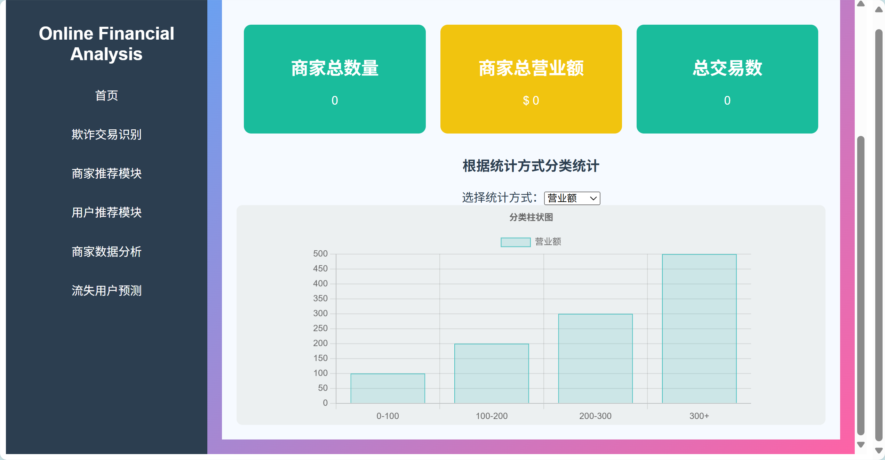

```markdown
# 🚀 电商智能风控与推荐系统
   
## 🌟 项目背景
随着电商与金融服务的快速发展，平台面临三大核心挑战：
1. **欺诈交易**威胁资金安全与商家信誉
2. **海量数据**需要高效分析挖掘价值
3. **用户维系**需精准推荐与流失预警

## 🎯 项目目标
构建五维智能解决方案：

| 模块               | 核心技术               | 关键指标                 |
|--------------------|------------------------|--------------------------|
| 欺诈识别           | 机器学习模型           | 准确率≥95%，召回率≥90%   |
| 商家数据分析       | Spark分布式计算        | 数据处理速度提升10倍     |
| 商品推荐系统       | 协同过滤算法           | 点击率提升30%            |
| 用户推荐系统       | 神经网络模型           | 转化率提升25%            |
| 流失预警           | LSTM时序分析           | 预测准确率≥88%           |

## 💻 技术栈


## 📊 数据资产
**数据集**：[Financial Transactions Dataset](https://www.kaggle.com/datasets/computingvictor/transactions-fraud-datasets)
- 交易记录：1322万条（2010-2019）
- 欺诈标签：827万条
- 用户画像：2000+维度
- 实时处理：5000+TPS

## 🛠️ 核心模块
### 1. 欺诈检测引擎
```python
def detect_fraud(transaction):
    # 使用XGBoost模型实时预测
    risk_score = model.predict(transaction) 
    return risk_score > 0.85
```

### 2. 智能推荐系统
**双推荐架构**：
```math
\begin{cases}
商品推荐：\hat{y}_{ui} = \sum_{j\in N(i)}w_{ij}r_{uj} \\
用户推荐：P(u|v) = \frac{exp(\phi(u,v))}{\sum_{u'}exp(\phi(u',v))}
\end{cases}
```

### 3. 流失预警模型
**LSTM网络结构**：
```
Input → LSTM(128) → Dropout(0.2) → Dense(1)
```

## 🚨 性能挑战与解决方案
| 挑战类型         | 解决方案                          | 效果提升               |
|------------------|-----------------------------------|------------------------|
| 数据质量         | Spark SQL动态清洗                 | 缺失值处理效率↑40%     |
| 实时性要求       | Kafka+Flume管道                  | 延迟<500ms             |
| 模型泛化         | 集成学习+特征交叉                 | AUC提升0.15            |


